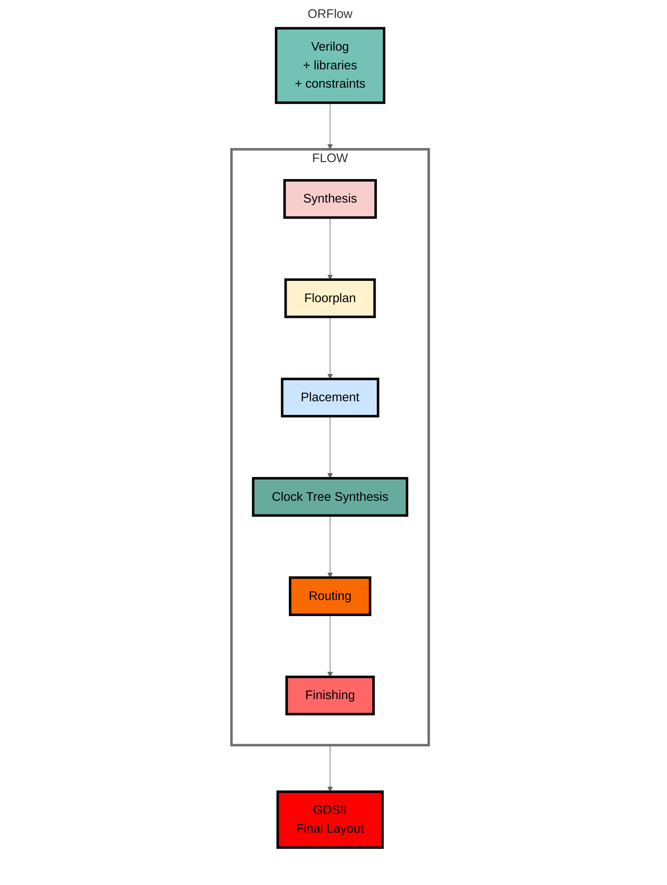
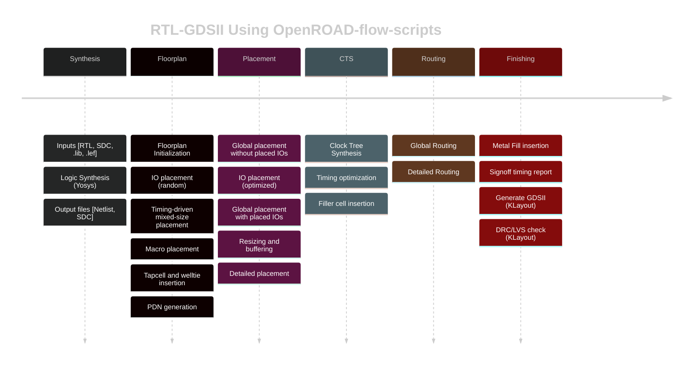

# 🧩 OpenROAD Flow Installation Guide (Ubuntu)

This guide provides a simple step-by-step process to install **OpenROAD Flow** on your Ubuntu system and run the test design `nand45`.

---

## 🖥️ Supported Versions

- Ubuntu **20.04** or **22.04 LTS**
- Internet connection required
- Recommended: 16 GB RAM, 4+ CPU cores

---
# OpenROAD

[](https://jenkins.openroad.tools/job/OpenROAD-Public/job/master/)
[](https://scan.coverity.com/projects/the-openroad-project-openroad)
[](https://openroad.readthedocs.io/en/latest/?badge=latest)
[](https://bestpractices.coreinfrastructure.org/en/projects/5370)

## About OpenROAD

OpenROAD is the leading open-source, foundational application for
semiconductor digital design. The OpenROAD flow delivers an
Autonomous, No-Human-In-Loop (NHIL) flow, 24 hour turnaround from
RTL-GDSII for rapid design exploration and physical design implementation.




## OpenROAD Mission

[OpenROAD](https://theopenroadproject.org/) eliminates the barriers
of cost, schedule risk and uncertainty in hardware design to promote
open access to rapid, low-cost IC design software and expertise and
system innovation. The OpenROAD application enables flexible flow
control through an API with bindings in Tcl and Python.

OpenROAD is used in research and commercial applications such as,
- [OpenROAD-flow-scripts](https://github.com/The-OpenROAD-Project/OpenROAD-flow-scripts)
  from [OpenROAD](https://theopenroadproject.org/)
- [OpenLane](https://github.com/The-OpenROAD-Project/OpenLane) from
  [Efabless](https://efabless.com/)
- [Silicon Compiler](https://github.com/siliconcompiler/siliconcompiler)
  from [Zero ASIC](https://www.zeroasic.com/)
- [Hammer](https://docs.hammer-eda.org/en/latest/Examples/openroad-nangate45.html)
  from [UC Berkeley](https://github.com/ucb-bar)
- [OpenFASoC](https://github.com/idea-fasoc/OpenFASOC) from
  [IDEA-FASoC](https://github.com/idea-fasoc) for mixed-signal design flows

OpenROAD fosters a vibrant ecosystem of users through active
collaboration and partnership through software development and key
alliances. Our growing user community includes hardware designers,
software engineers, industry collaborators, VLSI enthusiasts,
students and researchers.

OpenROAD strongly advocates and enables IC design-based education
and workforce development initiatives through training content and
courses across several global universities, the Google-SkyWater
[shuttles](https://platform.efabless.com/projects/public) also
includes GlobalFoundries shuttles, design contests and IC design
workshops. The OpenROAD flow has been successfully used to date
in over 600 silicon-ready tapeouts for technologies up to 12nm.

## Getting Started with OpenROAD-flow-scripts

OpenROAD provides [OpenROAD-flow-scripts](https://github.com/The-OpenROAD-Project/OpenROAD-flow-scripts)
as a native, ready-to-use prototyping and tapeout flow. However,
it also enables the creation of any custom flow controllers based
on the underlying tools, database and analysis engines. Please refer to the flow documentation [here](https://openroad-flow-scripts.readthedocs.io/en/latest/).

OpenROAD-flow-scripts (ORFS) is a fully autonomous, RTL-GDSII flow
for rapid architecture and design space exploration, early prediction
of QoR and detailed physical design implementation. However, ORFS
also enables manual intervention for finer user control of individual
flow stages through Tcl commands and Python APIs.

Figure below shows the main stages of the OpenROAD-flow-scripts:



Here are the main steps for a physical design implementation
using OpenROAD;

- `Floorplanning`
  - Floorplan initialization - define the chip area, utilization
  - IO pin placement (for designs without pads)
  - Tap cell and well tie insertion
  - PDN- power distribution network creation
- `Global Placement` 
  - Macro placement (RAMs, embedded macros)
  - Standard cell placement
  - Automatic placement optimization and repair for max slew,
    max capacitance, and max fanout violations and long wires
- `Detailed Placement`
  - Legalize placement - align to grid, adhere to design rules
  - Incremental timing analysis for early estimates
- `Clock Tree Synthesis` 
  - Insert buffers and resize for high fanout nets
- `Optimize setup/hold timing`
- `Global Routing`
  - Antenna repair
  - Create routing guides
- `Detailed Routing`
  - Legalize routes, DRC-correct routing to meet timing, power
    constraints
- `Chip Finishing`
  - Parasitic extraction using OpenRCX
  - Final timing verification
  - Final physical verification
  - Dummy metal fill for manufacturability
  - Use KLayout or Magic using generated GDS for DRC signoff

### GUI

The OpenROAD GUI is a powerful visualization, analysis, and debugging
tool with a customizable Tcl interface. The below figures show GUI views for
various flow stages including floorplanning, placement congestion,
CTS and post-routed design.
---
## ⚙️ Step 1: Install Required Dependencies

Update your package list and install the necessary tools:

```bash
sudo apt update && sudo apt upgrade -y
sudo apt install -y git build-essential python3 python3-pip cmake clang bison flex libreadline-dev gawk tcl-dev libffi-dev graphviz xdot pkg-config libboost-system-dev libboost-python-dev libboost-filesystem-dev zlib1g-dev
```

---

## 📦 Step 2: Clone the OpenROAD Repository

```bash
git clone https://github.com/The-OpenROAD-Project/OpenROAD.git
cd OpenROAD
```

---

## 🔧 Step 3: Install Dependencies

Run the dependency installer script:

```bash
sudo ./etc/DependencyInstaller.sh -all
```

If you see an error like:

```
sudo: ./etc/DependencyInstaller.sh: command not found
```
make it executable:

```bash
chmod +x ./etc/DependencyInstaller.sh
sudo ./etc/DependencyInstaller.sh -all
```

If prompted with:
```
ERROR] You must use one of: -all, -base, or -common.
```
use:
```bash
sudo ./etc/DependencyInstaller.sh -all
```

---

## 🏗️ Step 4: Build OpenROAD

```bash
mkdir build
cd build
cmake ..
make
sudo make install
```

Verify installation:

```bash
openroad -version
```

---

## 🚀 Step 5: Run Example (nand45)

Run the default example flow to verify installation:

```bash
cd flow
make DESIGN=nand45
```

After completion, check the results:

```
flow/results/nand45/
```

---

## 🧹 Step 6: Clean Build Files

```bash
make clean_all
```

---

## ⚠️ Troubleshooting

| Issue | Cause | Solution |
|-------|--------|-----------|
| `command not found` | Script not executable | `chmod +x ./etc/DependencyInstaller.sh` |
| `ERROR] You must use one of: -all, -base, or -common` | Wrong argument | Use `-all` |
| `Permission denied` | Missing sudo rights | Run with `sudo` |
| Build fails | Missing dependencies | Rerun dependency installer |

---

## 📚 References

- [OpenROAD GitHub Repository](https://github.com/The-OpenROAD-Project/OpenROAD)
- [OpenROAD Documentation](https://openroad.readthedocs.io/en/latest/)

---

### ✅ Done! You have successfully installed OpenROAD Flow on Ubuntu.
